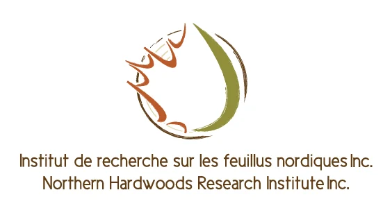
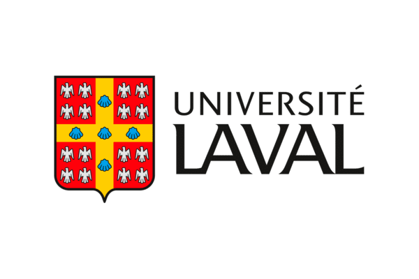
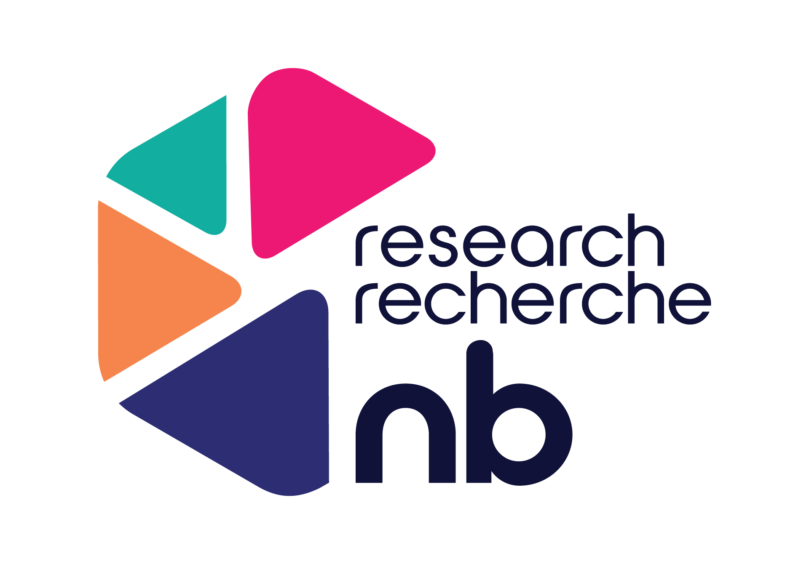

## Industry Partners

::: {.collaboration-record}

  

### Northern Hardwood Research Institute (NHRI)

The NHRI is a primary partner in our efforts to develop adaptive silviculture tools. With NHRI, we investigate the potential decline of deciduous tree species in the Acadian forest of New Brunswick under climate change and work toward solutions for the forest industry.

<a href="https://hardwoodsnb.ca/" class="btn-link">Visit Website</a>

:::

***

::: {.collaboration-record}

  

### Ouranos Climate Center

Ouranos is a key research partner that provides high-quality future climate data derived from a range of widely accepted climate models, supporting our work in climate change impact assessment and adaptation planning.

<a href="https://www.ouranos.ca/en" class="btn-link">Visit Website</a>

:::

***

## University Partners

::: {.collaboration-record}

  

### Université Laval - Faculté de foresterie, de géographie et de géomatique

In collaboration with Dr. Loïc D’Orangeville, we conduct research on tree species migration and seedling performance under climate change. We also collaborate with Dr. Guillaume Moreau on maple syrup production, silviculture, and ecology under climate change.

<a href="https://www.ffgg.ulaval.ca/" class="btn-link">Visit Website</a>

:::

***

::: {.collaboration-record}

  

### University of New Brunswick - Forestry & Environmental Management

In collaboration with Dr. Anthony Taylor, we conduct research on the adaptation of landscape-level forest planning to climate change.

<a href="https://www.unb.ca/fredericton/forestry/" class="btn-link">Visit Website</a>

:::

## Funding Partners

::: {.collaboration-record}

  

### Research New Brunswick

Research NB has supported many of our forest research projects in New Brunswick. It is a reliable and essential funding partner of this lab.

<a href="https://researchnb.ca/" class="btn-link">Visit Website</a>

:::
