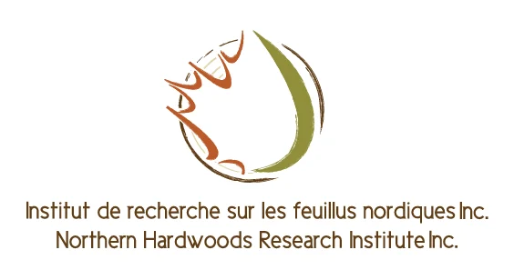
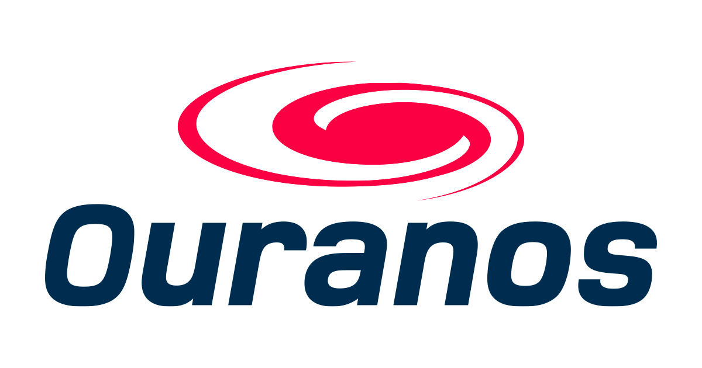
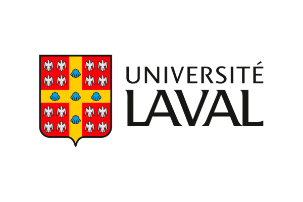
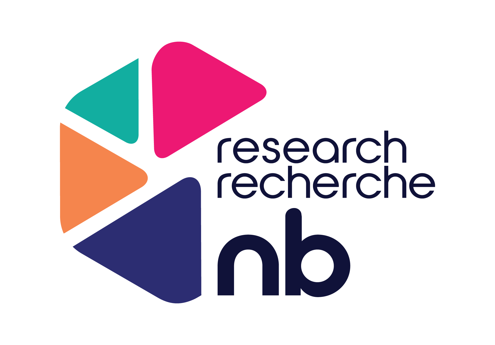

## Industry and research partners

:::: {.card-grid .two}

::: {.tile}
[{.partner-logo fig-alt="NHRI logo"}](https://hardwoodsnb.ca/)

### Northern Hardwood Research Institute (NHRI)

A primary partner in developing adaptive silviculture tools. Together we study the potential decline of hardwood species in New Brunswick's Acadian forest under climate change, and work on practical responses for the forest industry.

[hardwoodsnb.ca](https://hardwoodsnb.ca/){.more}
:::

::: {.tile}
[{.partner-logo fig-alt="Ouranos logo"}](https://www.ouranos.ca/en)

### Ouranos

Ouranos provides future climate data from a range of widely used climate models. These projections underpin our climate impact assessments and adaptation planning work.

[ouranos.ca](https://www.ouranos.ca/en){.more}
:::

::::

## University partners

:::: {.card-grid .two}

::: {.tile}
[{.partner-logo fig-alt="Université Laval logo"}](https://www.ffgg.ulaval.ca/)

### Université Laval

**Faculté de foresterie, de géographie et de géomatique.** With Dr. Loïc D'Orangeville, we study tree species migration and seedling performance under climate change. With Dr. Guillaume Moreau, we work on maple syrup production, silviculture and ecology under climate change.

[ffgg.ulaval.ca](https://www.ffgg.ulaval.ca/){.more}
:::

::: {.tile}
[{.partner-logo fig-alt="UNB logo"}](https://www.unb.ca/fredericton/forestry/)

### University of New Brunswick

**Forestry and Environmental Management.** With Dr. Anthony Taylor, we work on adapting landscape-level forest planning to climate change.

[unb.ca/forestry](https://www.unb.ca/fredericton/forestry/){.more}
:::

::::

## Funding partners

:::: {.card-grid .two}

::: {.tile}
[{.partner-logo fig-alt="Research NB logo"}](https://researchnb.ca/)

### Research New Brunswick

Research NB has funded many of our forest research projects in New Brunswick and remains one of the lab's core funding partners.

[researchnb.ca](https://researchnb.ca/){.more}
:::

::::
