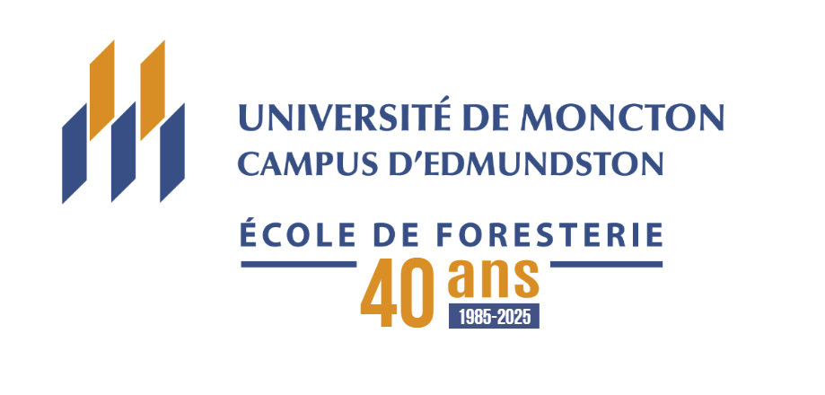

Welcome to the **Climate Change and Forest Ecosystems Lab**. We are based at the **École de Foresterie de l'Université de Moncton Campus d'Edmundston**, where we bridge the gap between forest ecology and computational analytics. 

Our mission is to quantify climate change impacts on forest ecosystems and develop adaptive management strategies that support the long-term sustainability of forest biomes across North America.

  

