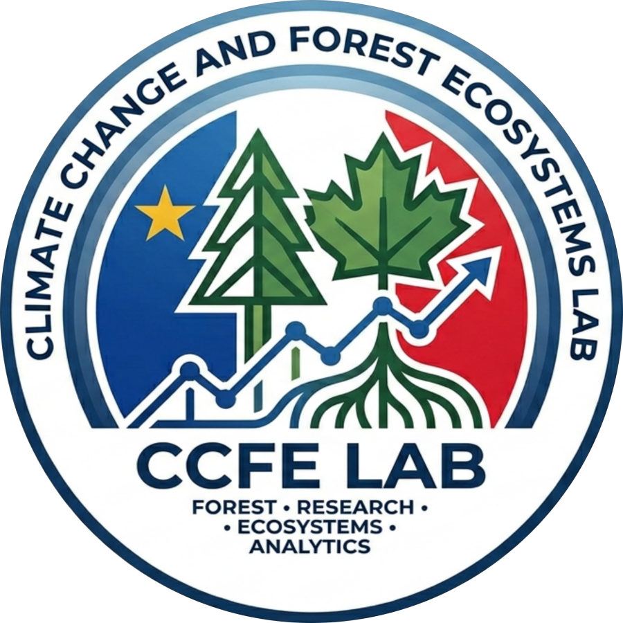
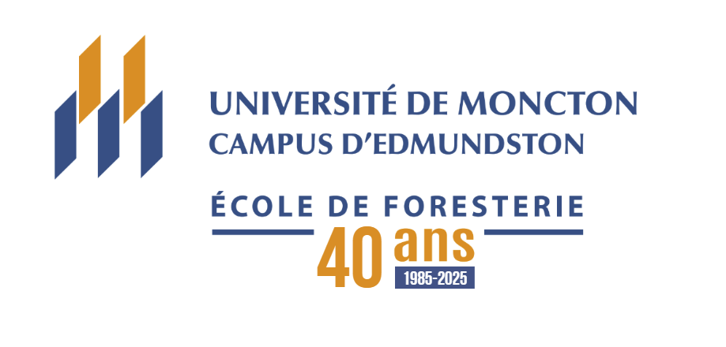

::: {.hero}

::: {.hero-text}
[École de foresterie · Université de Moncton, Edmundston]{.eyebrow}

# Climate Change and Forest Ecosystems Lab

::: {.lead}
We study how a changing climate is reshaping the forests of New Brunswick and eastern North America, and we build the models and planning tools that forest managers need to adapt.
:::

[Our research](research.qmd){.btn .btn-primary} [Join the lab](join.qmd){.btn .btn-outline-primary}
:::

{fig-alt="CCFE Lab logo"}

:::

## What we work on

:::: {.card-grid}

::: {.tile}
### Climate impacts on stands
Process-based growth models and tree-ring data tell us how heat and drought stress are changing growth, survival and species composition in the Acadian forest.
:::

::: {.tile}
### Landscape-level planning
We bring climate projections into long-term strategic forest planning, so that wood supply forecasts and harvest schedules reflect the forest we will actually have.
:::

::: {.tile}
### Adaptive silviculture
Field experiments on thinning, seed sources and assisted migration test which practices keep stands productive and resilient under warmer, drier conditions.
:::

::::

Four projects are currently active: **TransX**, **ThiRST**, **ALERT** and **CLIMCON**, each open to graduate students.

[See all projects](research.qmd){.more}

## Where we are

The lab is part of the École de foresterie at the Université de Moncton's Edmundston campus, in northwestern New Brunswick. We work closely with industry, government and university partners across the Maritimes and Quebec.

::: {.logo-strip}
[{fig-alt="Université de Moncton, École de foresterie"}](https://www.umoncton.ca/umce-foresterie/)
[{fig-alt="Northern Hardwood Research Institute"}](collab.qmd)
[{fig-alt="Ouranos"}](collab.qmd)
[{fig-alt="Université Laval"}](collab.qmd)
[{fig-alt="University of New Brunswick"}](collab.qmd)
[{fig-alt="Research New Brunswick"}](collab.qmd)
:::
