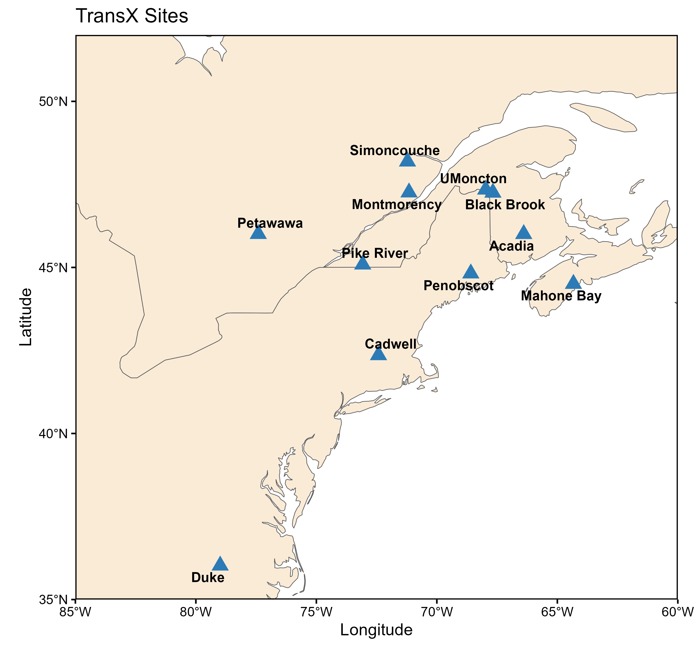
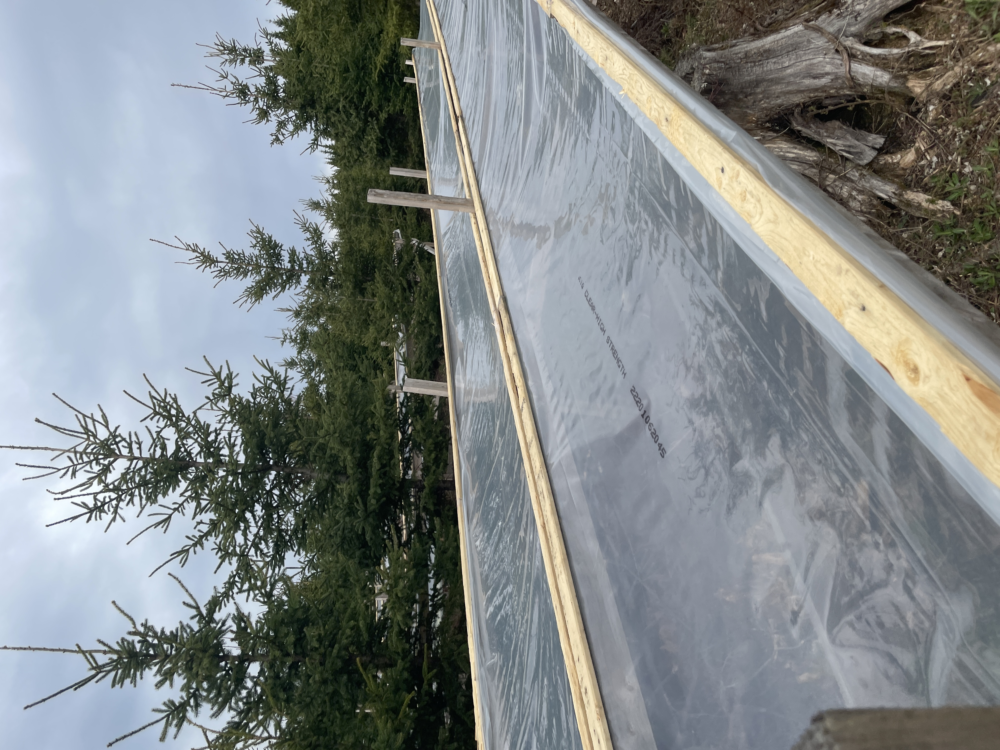
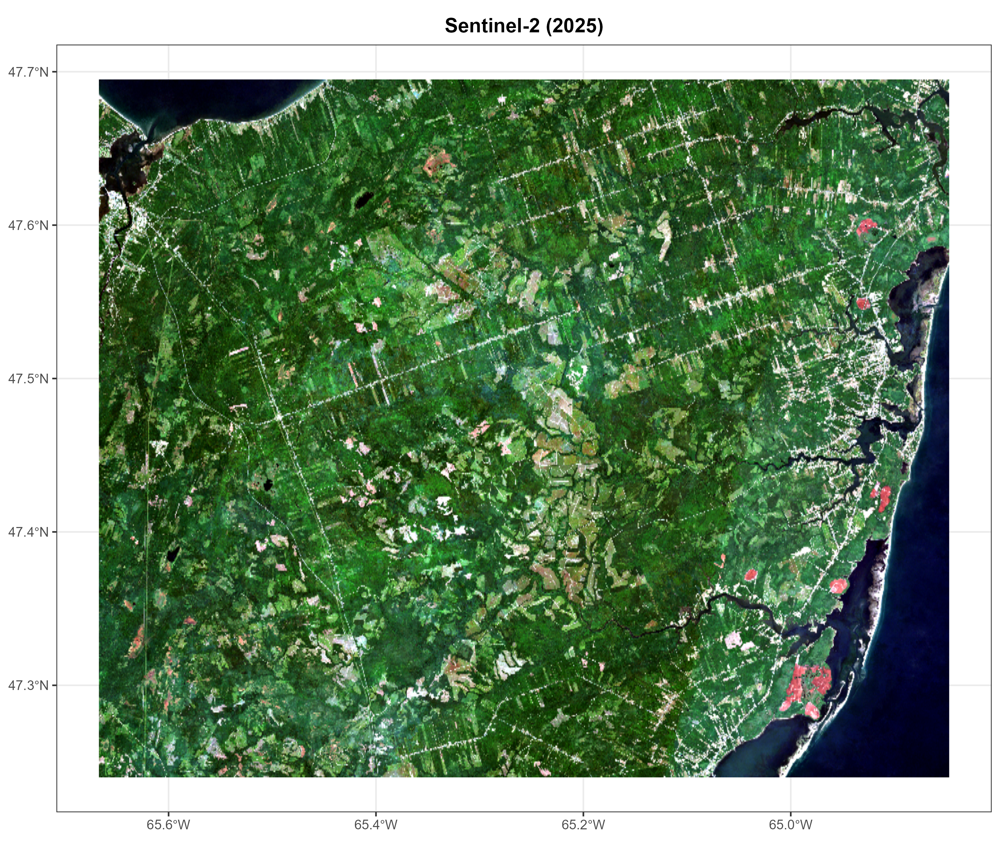
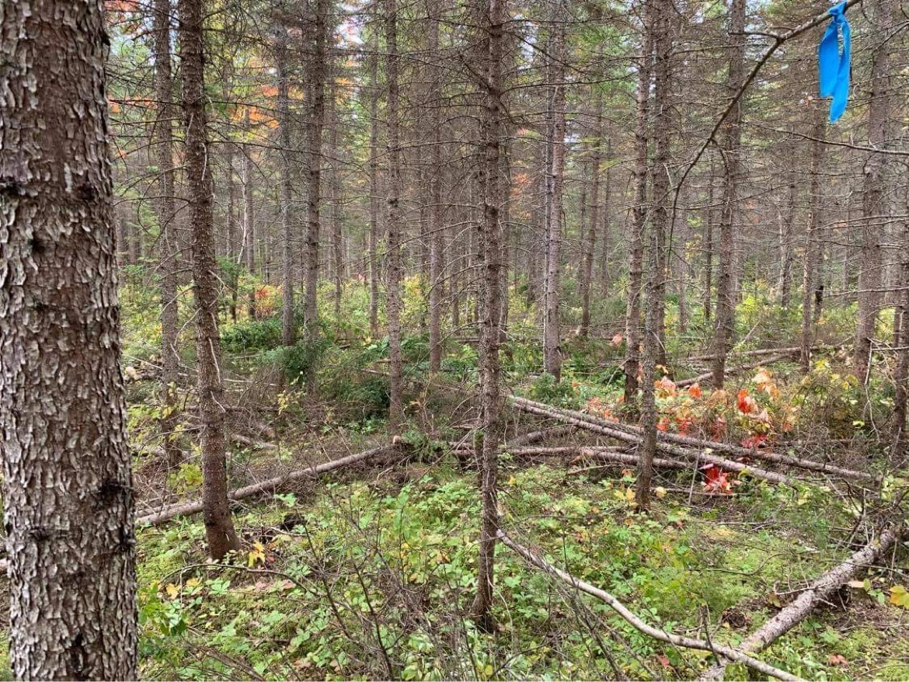

Navigate through our active research initiatives using the tabs below.

::: {.panel-tabset}

## TransX

### Transborder experimental assessment of warming vulnerability in northeastern tree species and their assisted migration potential

::: {layout="[45, 55]"}

::: {#first-column}
#### Project Overview
The TransX project addresses the risks posed by climate change to our northern forests. By evaluating tree species and provenances across a large warming gradient, we aim to identify the genetic stock that will maintain and improve productivity and ensure the resilience of the overall wood supply in Eastern Canada and the US.

::: {.status-badge}
**Data Status:** Collection Ongoing
:::

::: {.student-badge}
**Student Status:** Looking for Candidate
:::

::: {.funding-badge}
**Funding Status:** Funded
:::

#### Partners & Links

* [Project Lead Website](https://www.dorangevillelab.ca/transx-exp)
* [Silva21 Research Portal](https://www.silva21.com/projects/assisted-migration-trials:-implementation)
:::

::: {#second-column}
{.research-img}
:::

:::

#### Main Project Objectives

* **Objective 1:** Assess the warming tolerance of key natural hardwood and softwood species and populations to inform adaptive silviculture strategies.
* **Objective 2:** Assess the cold tolerance of southern populations to inform assisted migration and changes in seed transfer zones.
* **Objective 3:** Quantify genetic control of growth and survival across temperature range for well-known improved progenies.

## ThiRST

### Large-scale experimental assessment of pre-commercial thinning to reduce the vulnerability of drought

::: {layout="[45, 55]"}

::: {#thirst-desc}
#### Project Overview
The ThiRST experiment, established in 2022, is a silvicultural study designed to evaluate whether pre-commercial thinning can help mitigate drought-related stress in white spruce stands. This question is increasingly relevant for the forestry sector, as projections indicate a rise in both the frequency and intensity of drought events, with potential impacts on the growth and yield of commercially important softwood species. By reducing stand density, pre-commercial thinning may improve water availability to individual trees and enhance their resilience. The trial is located in the Black Brook district of New Brunswick on land managed by J.D. Irving Ltd.

::: {.status-badge}
**Data Status:** Collection Ongoing
:::

::: {.student-badge}
**Student Status:** Looking for Candidate
:::

::: {.funding-badge}
**Funding Status:** Not Currently Funded
:::

:::

::: {#second-column}
{.research-img}
:::

:::

#### Main Project Objectives
* **Objective 1:** To assess the vulnerability of white spruce plantations to water deficit.
* **Objective 2:** To evaluate the effectiveness of pre-commercial thinning in reducing white spruce stress under water deficit.

## ALERT

### Acadian Land-use Evaluation of Resource Trade-offs

::: {layout="[45, 55]"}

::: {#thirst-desc}
#### Project Overview
This project examines how land use is evolving across the Acadian Peninsula and the implications of these changes for forest ecosystems, agricultural production, and other competing land uses such as peatland development. As pressures on land intensify in eastern Canada, understanding the balance between forest management, blueberry cultivation, peat extraction, and other uses has become critical for sustainable regional planning.

::: {.status-badge}
**Data Status:** Data available
:::

::: {.student-badge}
**Student Status:** Looking for Candidate
:::

::: {.funding-badge}
**Funding Status:** Partly Funded
:::

:::

::: {#second-column}
{.research-img}

:::

:::

#### Main Project Objectives
* **Objective 1:** Quantify and characterize long-term land-use and land-cover changes across the Acadian Peninsula (e.g., forest, agriculture/blueberries, peatlands) using multi-temporal remote sensing data and spatial analysis.
* **Objective 2:** Identify and assess the main biophysical and socio-economic drivers of land-use change and evaluate their implications for forest ecosystems and regional land-use sustainability.

## CLIMCON

### CLIMate impacts on CONifer plantations

::: {layout="[45, 55]"}

::: {#thirst-desc}
#### Project Overview
This research examines how silvicultural practices and climate variability jointly influence the productivity of white spruce plantations in eastern Canada. It integrates growth modeling, dendroclimatology, and climate change projections to understand how stand structure, thinning intensity, and climatic conditions interact across past, present, and future time horizons.

::: {.status-badge}
**Data Status:** Data available
:::

::: {.student-badge}
**Student Status:** Looking for Candidate
:::

::: {.funding-badge}
**Funding Status:** Not Currently Funded
:::

:::

::: {#second-column}
{.research-img}

:::

:::

#### Main Project Objectives
* **Objective 1:** Project future growth and timber yield of white spruce plantations under climate change scenarios, and evaluate how climate change may alter silvicultural outcomes and productivity in New Brunswick and Quebec.

:::