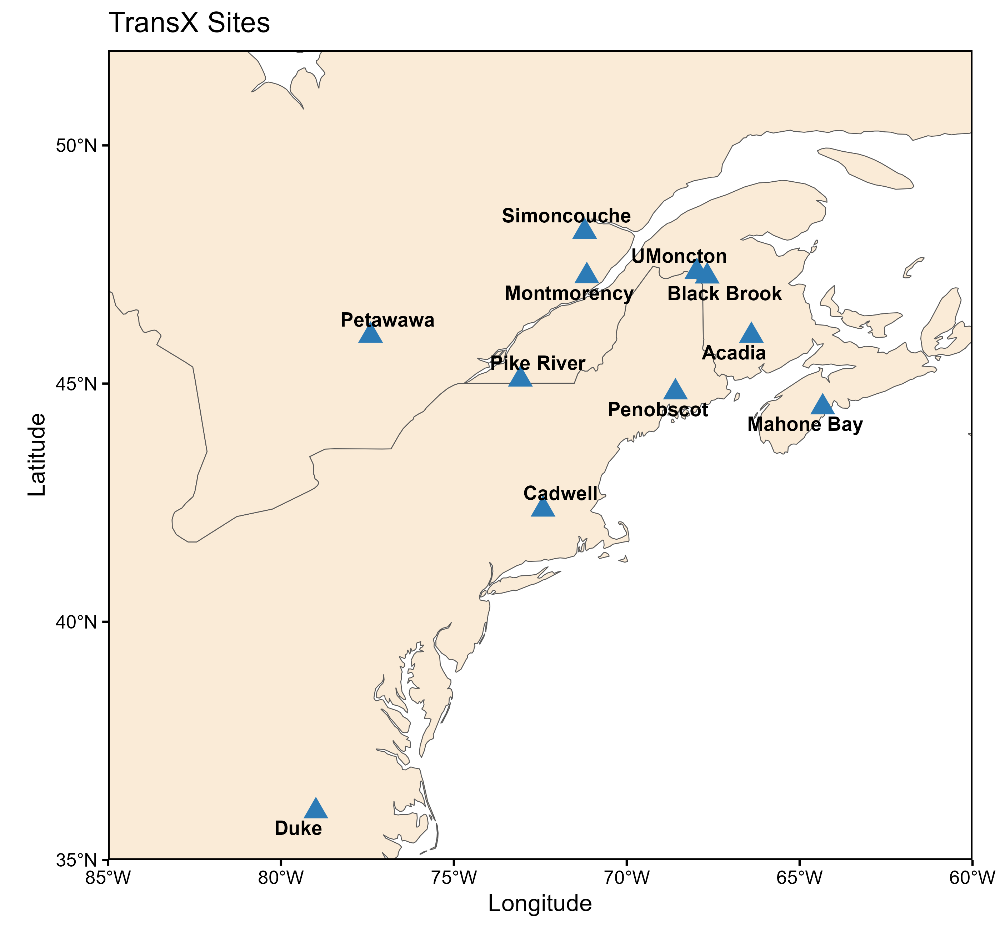
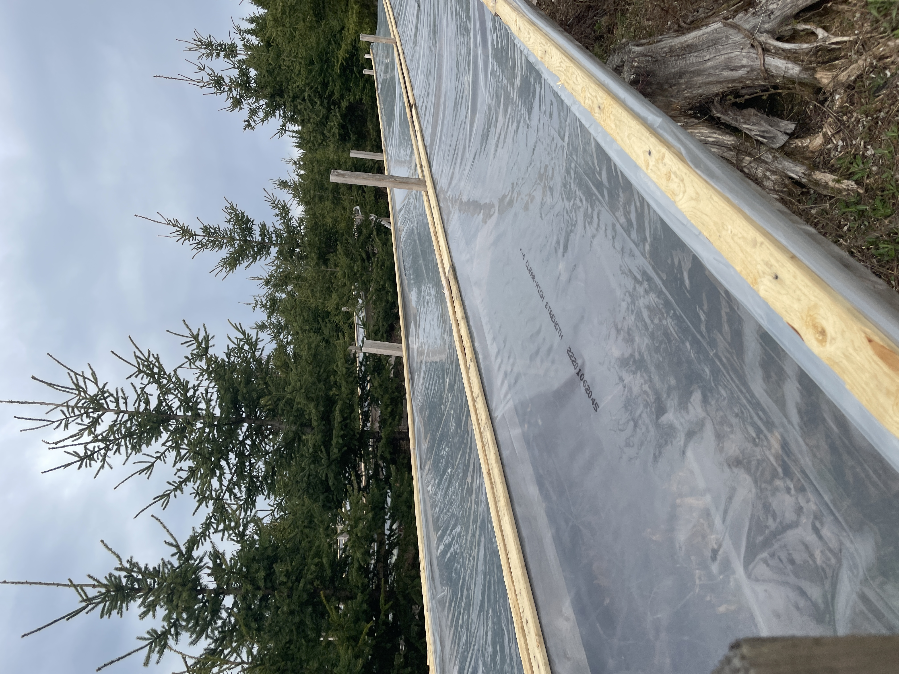
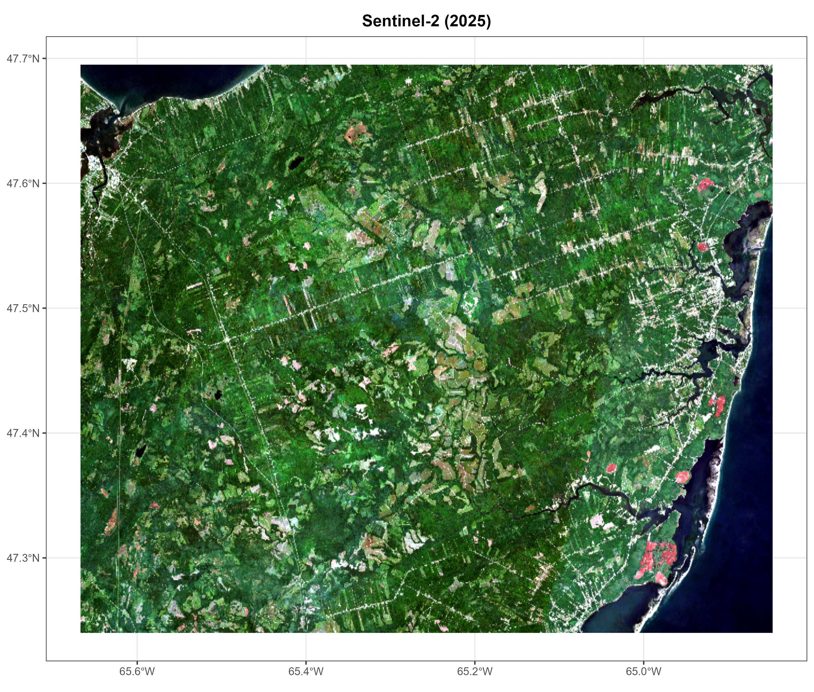
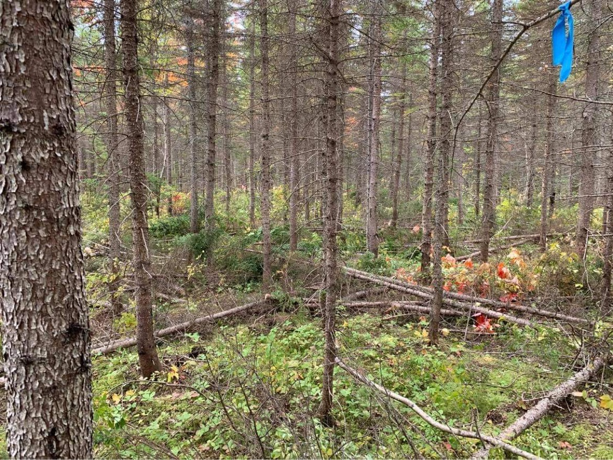

Our projects combine long-term field trials with modelling and remote sensing. Most are run with industry and university partners, and every project below has room for a graduate student.

::: {.callout-note appearance="simple"}
**Looking for a thesis project?** All four projects are open to MSc and PhD candidates. See [Join the lab](join.qmd) for how to get in touch.
:::

::: {.panel-tabset}

## TransX

::: {.project-title}
Transborder experimental assessment of warming vulnerability in northeastern tree species and their assisted migration potential
:::

[Data · Collection ongoing]{.status .partial} [Funding · Funded]{.status .ok} [Student · Position open]{.status .open}

::: {layout="[48, 52]" layout-valign="top"}

::: {.project-text}
TransX tests how northern tree species and their seed sources respond to warming. Trees from across their natural ranges are planted along a broad temperature gradient in eastern Canada and the US. The goal is to identify the genetic stock that will keep plantations productive and the regional wood supply secure as the climate warms.

#### Partners and links
- [Project lead website (D'Orangeville Lab)](https://www.dorangevillelab.ca/transx-exp)
- [Silva21 research portal](https://www.silva21.com/projects/assisted-migration-trials:-implementation)
:::

::: {.project-figure}
{.research-img}
:::

:::

#### Objectives
1. Assess the warming tolerance of key hardwood and softwood species and populations to inform adaptive silviculture.
2. Assess the cold tolerance of southern populations to guide assisted migration and revisions to seed transfer zones.
3. Quantify genetic control of growth and survival across the temperature range for well-known improved progenies.

## ThiRST

::: {.project-title}
Large-scale experimental assessment of pre-commercial thinning to reduce drought vulnerability
:::

[Data · Collection ongoing]{.status .partial} [Funding · Not currently funded]{.status .none} [Student · Position open]{.status .open}

::: {layout="[48, 52]" layout-valign="top"}

::: {.project-text}
Drought events are projected to become more frequent and more severe, with direct consequences for the growth of commercial softwoods. ThiRST, established in 2022, asks whether pre-commercial thinning can reduce drought stress in white spruce: with fewer stems competing, each tree may have more water available.

The trial is located in the Black Brook district of New Brunswick, on land managed by J.D. Irving Ltd.
:::

::: {.project-figure}
{.research-img}
:::

:::

#### Objectives
1. Assess the vulnerability of white spruce plantations to water deficit.
2. Evaluate how well pre-commercial thinning reduces white spruce stress under water deficit.

## ALERT

::: {.project-title}
Acadian Land-use Evaluation of Resource Trade-offs
:::

[Data · Available]{.status .ok} [Funding · Partly funded]{.status .partial} [Student · Position open]{.status .open}

::: {layout="[48, 52]" layout-valign="top"}

::: {.project-text}
Land on the Acadian Peninsula is under growing pressure from forestry, blueberry production and peat extraction. ALERT tracks how land use has changed across the peninsula and what those changes mean for forest ecosystems, agriculture and regional planning.
:::

::: {.project-figure}
{.research-img}
:::

:::

#### Objectives
1. Quantify long-term land-use and land-cover change across the Acadian Peninsula (forest, blueberry fields, peatlands) using multi-temporal satellite imagery and spatial analysis.
2. Identify the main biophysical and socio-economic drivers of that change and assess what it means for forest ecosystems and sustainable land use in the region.

## CLIMCON

::: {.project-title}
CLIMate impacts on CONifer plantations
:::

[Data · Available]{.status .ok} [Funding · Not currently funded]{.status .none} [Student · Position open]{.status .open}

::: {layout="[48, 52]" layout-valign="top"}

::: {.project-text}
How do thinning and climate together shape the productivity of white spruce plantations? CLIMCON combines growth modelling, dendroclimatology and climate projections to follow stand structure, thinning intensity and climate across past, present and future conditions.
:::

::: {.project-figure}
{.research-img}
:::

:::

#### Objectives
1. Project the future growth and timber yield of white spruce plantations under climate change scenarios, and evaluate how climate change may alter silvicultural outcomes in New Brunswick and Quebec.

:::
