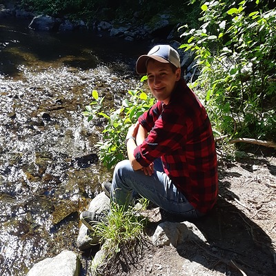
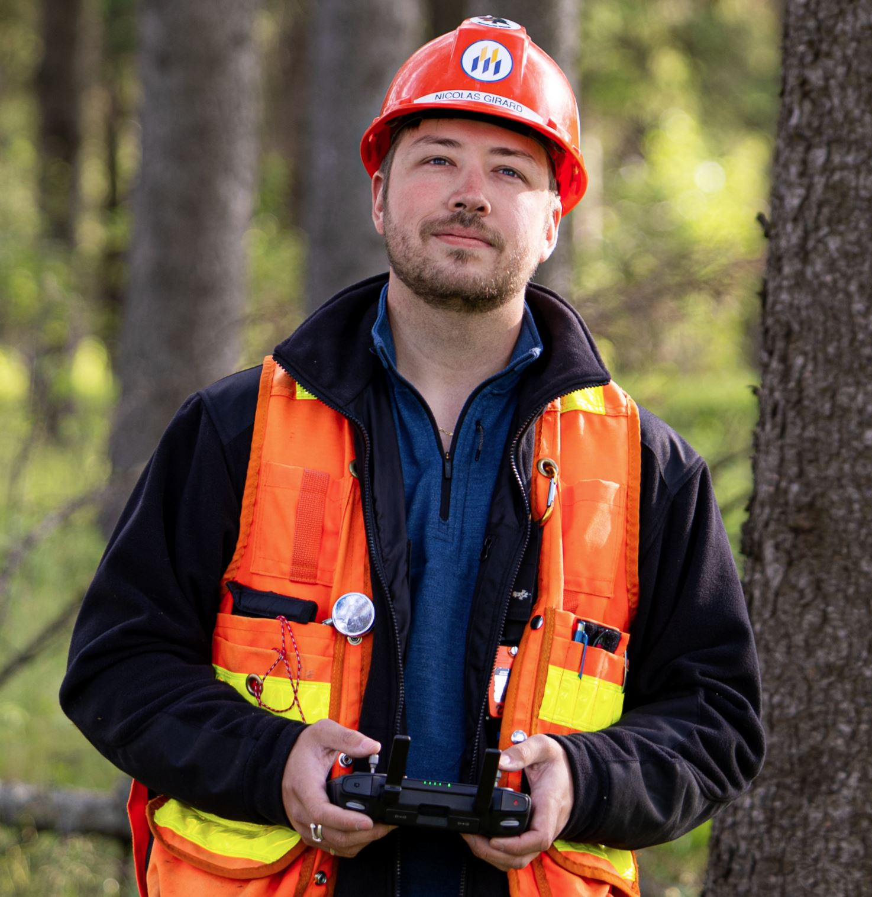

## Principal investigator

::: {.person}
{.profile-photo fig-alt="Cédric Albert"}

### Cédric Albert, PhD, RPF

[Assistant Professor of Forest Management]{.role}

I am an assistant professor at the École de foresterie, Université de Moncton (Edmundston campus). My research looks at how climate change is reshaping forests, with a focus on landscape-level forest management, spatial analysis and modelling. I develop tools that quantify climate impacts and help managers plan for more resilient forests across North America.

[Email](mailto:cedric.albert@umoncton.ca){.btn .btn-sm .btn-outline-primary} [ResearchGate](https://www.researchgate.net/profile/Cedric-Albert){.btn .btn-sm .btn-outline-primary}
:::

## PhD students

::: {.person}
{.profile-photo fig-alt="Joanie Dubé"}

### Joanie Dubé

[PhD in Life Sciences, Université de Moncton]{.role}

[Supervised]{.tag} [2026 – present]{.tag .muted} [TransX]{.tag .muted}

As part of the TransX project, Joanie studies how tree populations from different regions of North America perform when transplanted along a climatic gradient, as a test of assisted migration. She measures growth, survival and functional traits to understand how well these populations can adapt to new climates, with the aim of informing silvicultural strategies under climate change.

Originally from Edmundston, Joanie holds a BSc in Biology from the Université de Moncton and an MSc in Environmental Sciences from the Université du Québec à Montréal. She brings more than ten years of experience in ecology and environmental project management, mainly in wildlife conservation, ecosystem management and land-use planning, and teaches wildlife ecology at the Université de Moncton.
:::

::: {.person}
{.profile-photo fig-alt="Nicolas Girard"}

### Nicolas Girard

[PhD student, University of New Brunswick]{.role}

[Co-supervised]{.tag} [2026 – present]{.tag .muted}

Nicolas works on ecological forestry under climate change. He uses forest modelling and decision-support systems to turn natural disturbance regimes into practical management strategies at the landscape level.

Originally from the Lac-Saint-Jean region of Quebec, he holds a BSc in Forest Management and an MSc in Forest Sciences from the Université de Moncton. Before starting his PhD, he managed the Université de Moncton's Experimental Forest as a professional forester and taught forestry field courses. Outside work, he enjoys fishing, gaming and 80s rock.
:::

## MSc students

::: {.person}
{.profile-photo fig-alt="Louison Mvika"}

### Louison Mvika

[MSc student]{.role}

[Co-supervised]{.tag} [2026 – present]{.tag .muted}

<!-- Replace with a 2–3 sentence project description. -->
Project description coming soon.
:::

::: {.person}
{.profile-photo fig-alt="Louison Mvika"}

### Ayden MacFarlane

[MSc student]{.role}

[Co-supervised]{.tag} [2026 – present]{.tag .muted}

<!-- Replace with a 2–3 sentence project description. -->
Project description coming soon.
:::